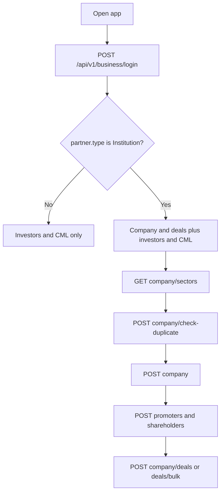

# App handoff — 30 Sep 2026

Read this first. The Hoppscotch collection has the requests. Field-by-field rules are in [partner.md](partner.md) and [institution.md](institution.md).

Base path: `/api`. Every request needs header `headtoken`. After login, also send `Authorization: Bearer <token>`.

Success is HTTP 200 with JSON `status` `1`. A business failure is also HTTP 200 with `status` `0` and `message`.

## Seller app becomes Institution

The old seller app logs in as a seller and calls `/api/v2/seller/...`. That app and those URLs stay as they are.

The new company-and-deals user is an **Institution partner**. They log in with the partner login, then call the same company work under `/api/v2/business/institution/...`. A seller token does not work on these URLs. An Institution token does not work on `/api/v2/seller/...`.



### Login and account

| Old seller app | Institution app |
|---|---|
| `POST /api/v2/seller/login` | `POST /api/v1/business/login` |
| `GET /api/v2/seller/profile` | `GET /api/v1/business/profile` |
| `POST /api/v2/seller/forgot-password` body `mobile_no` | `POST /api/v1/business/forgot-password` body `mobile_no` |
| resend / verify / change use `seller_id` | same three paths under `/api/v1/business/forgot-password/`, body uses `partner_id` |
| Seller token (`seller-api-guard`) | Partner token (`partner-api-guard`) |

Login body is the same shape: `mobile_no`, `password`, `firebase_token`, `device_id`, `device` (`web` \| `android` \| `ios` \| `desktop` \| `macos`).

After login, read `data.type`. Company and deal screens open only when `type` is `Institution`. Store `data.token` and `data.self_investor_id`. Profile returns the same `self_investor_id`.

### Company and deal URL map

Request bodies stay the same unless the row says otherwise. Full fields are in [institution.md](institution.md).

| Old seller | Institution |
|---|---|
| `POST /api/v2/seller/company/check-duplicate` | `POST /api/v2/business/institution/company/check-duplicate` |
| `POST /api/v2/seller/company` | `POST /api/v2/business/institution/company` |
| `GET /api/v2/seller/company/sectors` | `GET /api/v2/business/institution/company/sectors` |
| `GET /api/v2/seller/company/list` | `GET /api/v2/business/institution/company/list` |
| `GET /api/v2/seller/company/list-lite` | `GET /api/v2/business/institution/company/list-lite` |
| `GET /api/v2/seller/company/detail` | `GET /api/v2/business/institution/company/detail` |
| `GET /api/v2/seller/company/my-submissions` | `GET /api/v2/business/institution/company/my-submissions` |
| `POST /api/v2/seller/company/promoters` | `POST /api/v2/business/institution/company/promoters` |
| `POST /api/v2/seller/company/shareholders` | `POST /api/v2/business/institution/company/shareholders` |
| `GET /api/v2/seller/company/deals/list` | `GET /api/v2/business/institution/company/deals` |
| `POST /api/v2/seller/company/deals/create` | `POST /api/v2/business/institution/company/deals` |
| `POST /api/v2/seller/company/deals/update` | `POST /api/v2/business/institution/company/deals/update` |
| `POST /api/v2/seller/company/deals/delete` | `POST /api/v2/business/institution/company/deals/delete` |
| no seller bulk URL | `POST /api/v2/business/institution/company/deals/bulk` |

`is_editable` is true when this Institution submitted the company (`submitted_by_partner_id`). On the seller app it was true when `submitted_by_seller_id` matched the seller.

Create still goes live immediately (`approval_status` = `approved`). The typed deal amount is still the base. The server adds the admin processing fee and returns `share_price`.

These seller URLs have no Institution copy. Leave them on the old seller app:

- `POST /api/v2/seller/company/update-share-price`
- `GET /api/v2/seller/dashboard`
- `POST /api/v2/seller/profile/update`
- `GET /api/v2/seller/pre-ipo/transaction` and `transaction/detail`
- `GET /api/v2/seller/sell-enquiries/list`

Institution price entry is the deal create and the new bulk deals call. A normal deal updates today’s company price. A hot deal does not.

## Who calls what

| Partner type | Investors and CML | Company and deals |
|---|---|---|
| Wealth manager, distributor, retailer, institution | Yes | Institution only |
| Relation manager | Yes, on the parent’s clients. No self investor | No |

Any other partner type that calls an Institution company or deal URL gets `status` `0` and `Only Institution partners can submit a company`.

## 1. Investors (every partner)

`GET /api/v2/business/investor`

Required query: `is_kyc` = `All` | `Yes` | `No`, `is_active` = `All` | `Yes` | `No`. Optional: `is_aif` (default `All`), `relation_manager_ids` (comma-separated ids).

The logged-in partner’s own investor (`is_self` = `1`) is the first row when it matches those filters. Client rows stay `is_self` = `0`. The old `GET /api/v1/business/investor` still omits the self investor. Use v2 for the new list.

`POST /api/v2/business/investor`

Body:

```json
{
  "investor_type": "Individual",
  "name": "Client Name",
  "mobile_number": "9876543210",
  "email": "client@example.com",
  "gender": "Male"
}
```

`investor_type`, `name`, and `mobile_number` are required. `email` and `gender` are optional. Do not send password, address, city, or pincode. The new client is `is_self` = `0`. Access flags are copied from the logged-in partner. `POST /api/v1/business/investor` is unchanged.

## 2. CML KYC (every partner)

Both are `multipart/form-data`.

`POST /api/v2/business/investor/kyc/cml/read`

- `investor_id` (required)
- `cml` (required PDF, max 10 MB)

Returns parsed demat fields. This does not mark KYC complete. `preipo_kyc_status` stays as it was. If the PDF cannot be read, the file is sent for manual verification and `status` is `0`.

`POST /api/v2/business/investor/kyc/cml/save`

- Required: `investor_id`, `dp_id`, `client_id`, `pan_no`, `name`
- Optional: `account_number`, `ifsc_code`, `bank_name`, `dob` (`d-m-Y`), `cml_file` (PDF)

On success, that investor’s `preipo_kyc_status` becomes `1` and the investor `name` is replaced with `name`.

The investor must belong to this partner, or to a relation manager under this partner. Another partner’s investor returns `Investor not found`. A partner can read their own self investor. They can save CML for their clients.

## 3. Institution company

Only `partner.type` = `Institution`.

Suggested order: sectors → check duplicate → create → promoters / shareholders → deals.

| Method | Path | What the app does |
|---|---|---|
| GET | `/api/v2/business/institution/company/sectors` | Dropdown. Use `id` as `sector` on create |
| POST | `/api/v2/business/institution/company/check-duplicate` | Send `cin` and/or `company_name` before create |
| POST | `/api/v2/business/institution/company` | `multipart/form-data` because `logo` is a file |
| GET | `/api/v2/business/institution/company/list` | Approved catalog. `is_editable` is true only for companies this Institution submitted |
| GET | `/api/v2/business/institution/company/list-lite` | Id, name, logo. No pagination |
| GET | `/api/v2/business/institution/company/detail` | One of `slug`, `id`, or `uuid` |
| GET | `/api/v2/business/institution/company/my-submissions` | This Institution’s companies |
| POST | `/api/v2/business/institution/company/promoters` | Replace all promoters. `[]` clears them |
| POST | `/api/v2/business/institution/company/shareholders` | Replace all shareholders, grouped by year. `[]` clears them |

Create goes live immediately. There is no admin approval wait. Required fields: `type` (`unlisted` or `secondary`), `cin`, `brand_name`, `company_name`, `sector`, `about`, `min_investment_amount`, `lot_size`, `market_cap`, `pe_ratio`, `pb_ratio`, `debt_to_equity`, `roe`, `book_value`, `face_value`. Optional logo and identity fields are in [institution.md](institution.md).

Do not send `processing_fee_percentage` or `commission`. The server sets those.

## 4. Institution deals

The amount typed in the app is the base price. The server adds the admin processing fee and returns the customer price as `share_price`.

Formula: `share_price = round(base * (1 + fee / 100), 2)`.

Example at fee 1%: the app sends `100`, the response has `base_price` `100` and `share_price` `101`. Show `share_price` to the customer. Show `base_price` as the amount the Institution typed.

| Method | Path | Notes |
|---|---|---|
| POST | `/api/v2/business/institution/company/deals` | One deal. Field `share_price` is the base amount |
| POST | `/api/v2/business/institution/company/deals/bulk` | Many sell and/or buy rows |
| GET | `/api/v2/business/institution/company/deals` | This Institution’s deals only |
| POST | `/api/v2/business/institution/company/deals/update` | One owned deal, by `uuid` |
| POST | `/api/v2/business/institution/company/deals/delete` | Soft-delete one owned deal, by `uuid` |

Single create body: `company_id`, `deal_type` (`buy` or `sell`), `available_quantity`, `share_price` (base), `minimum_qty` (min 1). Optional: `status`, `is_hot_deal`, `expired_at` (`Y-m-d H:i:s`).

`is_hot_deal` true stores the deal and does not change today’s company price. A normal deal updates today’s company price.

Bulk body:

```json
{
  "sell": [
    { "company_id": 12, "sell_price": 20, "min_qty": 1000, "total_qty": null }
  ],
  "buy": [
    { "company_id": 12, "buy_price": 18, "min_qty": 500, "total_qty": null }
  ]
}
```

`sell_price` and `buy_price` are base amounts. A blank row or a zero price is skipped. At least one valid row is required. A row with a price but a bad company or `min_qty` below 1 fails the whole request and creates nothing.

Update sends the deal price as `share_price`. The fee is not added again. `base_price` stays as it was on create. `company_id` cannot be changed.

## What to build in the app

1. Log in with `POST /api/v1/business/login` (partner), not `POST /api/v2/seller/login`. Store `token` and `self_investor_id`. Open company and deal screens only when `type` is `Institution`.
2. Investor list uses v2 and treats the first `is_self` = `1` row as “my account”.
3. Create client with the five fields above, then CML read (prefill) and CML save (KYC done).
4. Institution screens: company form, then promoters, shareholders, and deals.
5. Deal entry shows the typed base and the returned `share_price` (base + fee).
